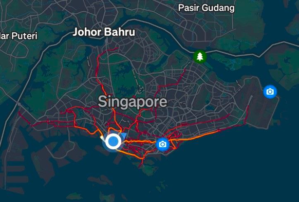

# My running journey

Midterms are over! Time to paint the town red!
But where are you going to celebrate?
Umm... I’m not going to a party or hanging out or anything like that. I’m literally going to paint the town red—well, the town of Singapore, that is.
But how?

You might be wondering how I "paint" the country. Obviously, I don't actually paint it—that would be illegal! Instead, I digitally map my routes using a running app called Strava. It tracks your running (and other activity) routes and compiles them into a personal heatmap, showing all the paths, you've covered.

Here’s a snapshot of my trails so far, as of 21st March 2025:

The trails stretch from the west to the east, with a few areas up north. The northwest part of the country remains unexplored—for now. It’s incredibly satisfying to see the result after half a year of effort.
But how did it all begin?

## My first journey

On a regular basis, I usually run at West Coast Park three times a week to exercise and relax. At the time, I disliked doing mindless tasks—like sweeping floors—so it was no surprise that I found West Coast Park painfully boring. My first "painting" venture began with a random thought during one of my runs at West Coast Park. I decided to run a bit farther to explore what lay beyond the west. The first destination that came to mind was Jurong East (EW24), which isn’t far from campus (about 8 km) and has an MRT station for the return trip.

Although the run was genuinely exhausting—it was the first time I’d managed to cover more than 5 km—the experience was surprisingly fun. Exploring new places has always fascinated me, and that’s when I started venturing out even further.
After that day, I started exploring other places within an 8–10 km radius, such as HarbourFront and Marina Bay (yes, they’re not that far from my campus). By that point, the southern part of the country had been painted.

## Journey to the west
How about the West? That’s a completely different story.

My second journey to the West—Jurong East was my first—started from West Coast Park. I looped around Pandan Reservoir, passed through Jalan Buroh, headed north on Corporation Road, ran along Boon Lay Way, and ended up at Pioneer MRT (EW28), four stations from Jurong East. That was the first 15 km I had ever run in my life, just 6 km short of a half marathon.

I ended up running to NTU after all, adding another 2 km and surprising my friend. I stayed there for an hour and almost miss the last bus.

Running to the West was no joke; it was extremely difficult and mentally draining for me. What makes running to the East so captivating is its colorful and lively atmosphere—there’s just so much to see. Compared to that, the West has little more than industrial buildings.

It took me a month after that run to finally reach Tuas Link (EW33), the last MRT station on the East-West line, completing the West with a total distance of 22 km.

## Journey to the east
The reason it took a month to complete the West was because I decided to focus on the eastern part instead. A week after running to NTU, I completed my first half marathon by running to Marina Bay, crossing the Benjamin Sheares Bridge, and stopping after about 5 km in East Coast Park—at McDonald’s.
While the East is more lively, the problem with finishing it is that it’s so damn long. For comparison, East Coast Park alone is already 15 km. There had to be a better strategy to complete the East, right?
The issue, unsurprisingly, rooted from my original route to Marina Bay. At that time, I took a 14 km path via HarbourFront (CC29), adding an unnecessary 2–3 km by heading too far south. Instead, I could’ve taken the Alexandra Park Connector and passed through Clarke Quay, reducing the distance to around 12 km. After realizing this, I decided to give it another shot.
This time, I managed to run 23 km, reaching Bayshore (TE29)—the last TE station to date—just 7 km short of completing the East.
The grind continued, but more often than not, I’d end up at McDonald’s (18 km) or Bayshore (23 km). The problem with going further is that once you pass Bayshore, it’s not easy to return—there are no MRT stations in between. The next one is Changi Airport, 7 km away.
When I arrived at Bayshore, my legs were numb and my feet in pain. I nearly had to stop. Even though East Coast Park is vibrant, that liveliness fades after Bayshore. What follows is just long stretches of dull parkland—it gave me serious West Coast Park flashbacks.
Still, I kept reminding myself: this was my only chance to conquer the East.
That day, I decided to push farther, running through East Coast Park G and H, counting sheep in my head to stay sane. I reached Changi Coast Walk at 26 km, thinking I was done—after all, it’s the end of East Coast Park.

But then reality hit: I still had almost 4 km to go.
I nearly gave up. But you know how these stories end.
I pushed through Changi Jurassic Park and, finally, made it to Changi Airport—30 km in total.
By then, the entire southern coast was complete. I was genuinely proud of myself. I never thought I’d run eighteen miles. I’d come a long way since that first run to Jurong East.
It was 10:30 PM—three and a half hours from my starting point. I had hoped to relax at the airport but instead had to rush back to campus—a journey of an hour and a half—before it got too late. My journey concluded at Supersnack, where I rewarded myself with a waffle after completing my first 30 km run.
## What’s next?
The rest of my runs were not as interesting. Most of my runs were started from my campus, except the journey to north east (NE17) that I’d started from Botanic Gardens (CC19/DT9), which is a story for another time. Another plan that has come to my mind just now is to run from Tuas Link (EW33) to Changi Airport (CG2), a 52 km run. This might be too difficult for me, so I may decide to focus on the northeastern part of the country first.

## Final thoughts
Running long distances is definitely tough, and I have a lot of respect for people who manage to finish a full marathon (42 km). While running may be painstakingly boring at first, I reimagined it as painting, which motivated me to continue one of the most boring sports ever for months. It’s so satisfying to see the final art piece after half-year of work. One takeaway I want you to have from this story is the importance of finding purpose or goals in your work. Even when the work is challenging or tedious, you can discover its enjoyment and appreciate the process.

